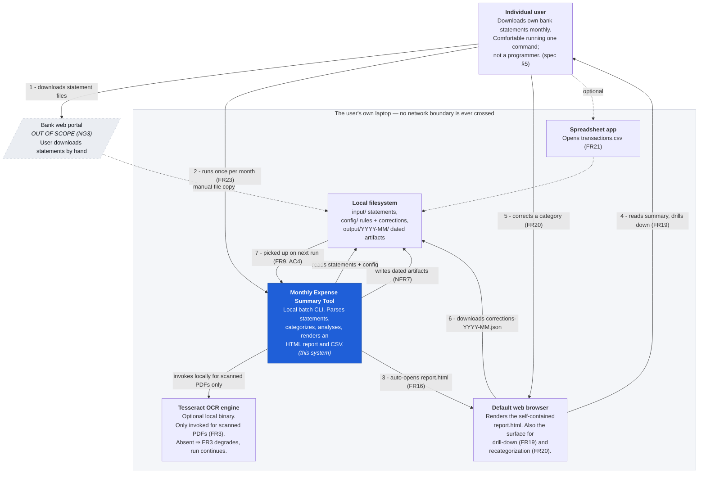
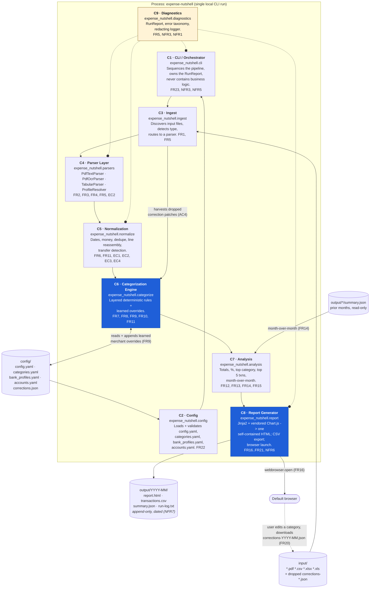

# 00 — Architecture Overview

**System:** Monthly Expense Summary Tool ("ExpenseInNutshell")
**Source spec:** `src\main\resources\specs\spec.md` — *Monthly Expense Summary Tool — Specification*, Status **Draft v1.0**, owner Madhubala Jadhav, last updated 2026-08-26.
**Architecture status:** Baselined for v1. Supersedes the empty IntelliJ Java skeleton (see [ADR-0001](04-adr/ADR-0001-language-and-runtime.md)).

---

## 1. Purpose

Turn a folder of downloaded bank statements into one screen that answers a single question:
**"where did most of my money go this month, and should I cut it back?"**

The system is a **local, offline, single-user batch tool**. The user drops statement files
into a folder, runs one command (or double-clicks one script), and a self-contained HTML
report opens in their browser showing spend by category, a pie chart with the top category
emphasized, and an explicit textual callout of that top category.

It is decision support, not accounting. It is deliberately not a server, not a service,
and not a budgeting app (NG1, NG2, NG3, NG4).

## 2. Scope

**In scope for v1** — everything covered by FR1–FR23 and NFR1–NFR7:
statement ingestion (PDF/CSV/XLSX/XLS), normalization and de-duplication, rule-based
categorization with persisted user corrections, monthly analysis with month-over-month
comparison, a self-contained interactive HTML report, and a CSV export.

**Out of scope** — NG1–NG5 and §15 of the spec: budgets/alerts/forecasting, multi-user or
cloud sync, bank API integration, investment/brokerage statements, and any promise of
100% categorization accuracy.

## 3. Quality attributes that drive the design

These are the forces that actually shaped the structure. Everything below is a consequence
of one of them.

| # | Attribute | Requirement | Architectural consequence |
|---|---|---|---|
| QA1 | **Privacy / offline-by-construction** | NFR1, AC8, §13 | No network layer exists in the codebase at all. Every asset the report needs (chart library, fonts, styles) is vendored and inlined at build time. There is nothing to accidentally leak because there is no client to leak with. Enforced by a CI/import-lint rule, not by discipline. |
| QA2 | **Graceful degradation** | NFR3, FR5, AC7, EC5 | Every stage is a *filter that reports*, not a step that throws. A `RunReport` diagnostics object threads through the whole pipeline; a failure at file scope, row scope, or field scope demotes that unit and records a reason, and the run continues. The report always renders — even with zero transactions. |
| QA3 | **Transparency of accuracy** | NFR6, FR8, FR3, AC5, NG5 | "Uncategorized" and "needs review" are first-class states with dedicated visual treatment, not silent guesses. `category_source` is carried on every transaction so the report can always explain *why* a transaction is where it is. |
| QA4 | **Repeatability without code changes** | FR22, FR23, NFR5 | All variability (folders, categories, keyword rules, bank column maps, account registry) lives in human-editable config files. Adding a new bank is a YAML edit, never a code change. |
| QA5 | **Portability** | NFR4 | One codebase, three OSes. No shell-outs to OS-specific tools in the core path; the only external binary (Tesseract, for OCR) is optional and its absence degrades FR3 rather than breaking the run. |
| QA6 | **Historical immutability** | NFR7, FR14, AC6 | Each month writes a new dated artifact directory that is never overwritten. Month-over-month comparison reads prior months' `summary.json`, so history is data, not a database. |
| QA7 | **Interface stability over implementation** | spec §9 | The spec explicitly says the stack is a suggestion but "the interfaces below (data model, file layout) should stay stable regardless of implementation choice." The `Transaction` and `MonthlySummary` shapes and the on-disk layout are therefore **frozen contracts** (see [03](03-interfaces-and-contracts.md)). |

## 4. C4 Level 1 — System context



**The one thing to notice:** there is no arrow leaving `machine` except the user's own
manual download from the bank portal, which happens *outside* this system. That is NFR1
and AC8 expressed structurally rather than as a policy someone has to remember.

## 5. C4 Level 2 — Containers / modules

The system is a single deployable process. "Containers" here are the internal modules and
the on-disk stores they own.



### The spec's own diagram, preserved for continuity

The spec's §9 ASCII pipeline is reproduced verbatim below. The Mermaid diagram above is
the same pipeline with two additions the spec implies but does not draw: the **Diagnostics**
cross-cutting concern (required by FR5/NFR3) and the **correction feedback loop** from the
browser back into the next run (required by FR9/FR20/AC4).

```
 ┌─────────────────────┐
 │  input/ folder       │  user drops statement files here (PDF/CSV/XLSX)
 └──────────┬───────────┘
            ▼
 ┌─────────────────────┐
 │  Parser Layer        │  PDF parser (table + OCR fallback)
 │                       │  CSV/Excel parser (per-bank column mapping)
 └──────────┬───────────┘
            │  normalized transactions
            ▼
 ┌─────────────────────┐
 │  Normalization &      │  de-dupe, currency/date normalization,
 │  Transfer Detection   │  internal-transfer flagging
 └──────────┬───────────┘
            ▼
 ┌─────────────────────┐
 │  Categorization Engine│  rule/keyword matching + learned overrides
 │                       │  (categories.yaml + corrections.json)
 └──────────┬───────────┘
            ▼
 ┌─────────────────────┐
 │  Analysis Layer       │  totals, % by category, top category,
 │                       │  month-over-month diff, top transactions
 └──────────┬───────────┘
            ▼
 ┌─────────────────────┐
 │  Report Generator     │  renders HTML (chart + tables) + CSV export
 └──────────┬───────────┘
            ▼
 ┌─────────────────────┐
 │  output/YYYY-MM/      │  report.html (auto-opens in browser),
 │                       │  transactions.csv
 └─────────────────────┘
```

## 6. Runtime sequence — one monthly run

```mermaid
sequenceDiagram
    autonumber
    actor U as User
    participant CLI as C1 CLI
    participant CFG as C2 Config
    participant ING as C3 Ingest
    participant PAR as C4 Parsers
    participant NRM as C5 Normalize
    participant CAT as C6 Categorize
    participant ANA as C7 Analysis
    participant REP as C8 Report
    participant RR as C9 RunReport
    participant B as Browser

    U->>CLI: run.bat / run.command (FR23)
    CLI->>CFG: load_config(config_dir)
    CFG-->>CLI: Config (validated) or ConfigError -> abort with a readable message
    CLI->>RR: start run
    CLI->>ING: harvest_correction_patches(input_dir)
    ING-->>CAT: merge into corrections.json (FR9, AC4)
    CLI->>ING: discover(input_dir)
    ING-->>CLI: [StatementFile] typed by extension + magic bytes (FR1)

    loop for each statement file
        CLI->>PAR: parse(file, config)
        alt PDF with a text layer
            PAR->>PAR: pdfplumber table extraction (FR2)
        else PDF, no text layer
            PAR->>PAR: OCR fallback, per-row confidence (FR3)
            PAR->>RR: flag low-confidence rows needs_review=true
        else PDF, password-protected
            PAR->>U: prompt once for password (in-memory only, §13)
        else CSV / XLSX / XLS
            PAR->>PAR: resolve bank profile, map columns (FR4)
            opt no profile matches
                PAR->>U: interactive column mapping, saved as a new profile (§11.2)
            end
        end
        alt parse failed entirely
            PAR->>RR: record ExcludedFile(name, reason) (FR5, AC7)
            Note over CLI,RR: run continues with remaining files (NFR3)
        else parsed
            PAR-->>CLI: [RawRow]
        end
    end

    CLI->>NRM: normalize(all_raw_rows)
    NRM->>NRM: reassemble wrapped descriptions (EC2)
    NRM->>NRM: parse dates + Decimal money, currency (EC4)
    NRM->>NRM: de-duplicate exact repeats (FR6, EC1)
    NRM->>NRM: pair-match internal transfers (FR11)
    NRM-->>CLI: [Transaction]

    CLI->>CAT: categorize(transactions)
    Note over CAT: correction > override > keyword rule > Uncategorized (FR7, FR8)
    CAT-->>CLI: [Transaction] with category + category_source

    CLI->>ANA: summarize(transactions, month)
    ANA->>ANA: totals, per-category %, top category (FR12, FR13)
    ANA->>ANA: top 5 transactions (FR15)
    ANA->>ANA: load prior summary.json -> MoM delta (FR14)
    ANA-->>CLI: MonthlySummary

    CLI->>REP: render(summary, transactions, run_report)
    REP->>REP: write transactions.csv (FR21)
    REP->>REP: write summary.json (FR14 input for next month)
    REP->>REP: inline chart lib + CSS + data -> report.html (FR16)
    REP->>B: webbrowser.open(file:// URL)
    B-->>U: dashboard: pie + table + top-category callout (US2, US3, US4)
    U->>B: click a slice -> drill-down (FR19)
    U->>B: change a category (FR20)
    B->>B: stage change in-page; "Save corrections" downloads a JSON patch
    U->>ING: drop the patch in input/ -> applied next run (AC4)
```

## 7. Why this shape

**The pipeline is a chain of pure, independently testable transforms with one mutable
sink at each end.** Parsing, normalization, categorization and analysis are all
`f(data, config) -> data`; only Ingest (reads files), Report (writes files), and the
corrections store (appends) touch the outside world. That is what makes NFR3 achievable:
each stage can demote a bad unit and hand the rest onward, because no stage owns
cross-cutting mutable state that a partial failure could corrupt. It is also what makes
QA1 structural rather than aspirational — the middle of the system has no I/O capability
at all, so there is no place a network call could hide.

**Everything variable is config, not code.** The spec's real long-tail cost is bank format
diversity (§11, OQ1): every bank labels columns differently and lays out PDF tables
differently. Baking those into code would mean a release per bank. Instead, `bank_profiles.yaml`
holds column maps and PDF table templates, `categories.yaml` holds the rules, and the parser
layer is a thin, generic engine over them. Supporting a new bank is a data change (QA4).

**History is files, not a database.** FR14 and NFR7 want prior months available and
un-overwritten. A dated directory per month with a machine-readable `summary.json` gives
month-over-month comparison, a natural audit trail, trivial backup, and zero schema
migration cost — at the price of no cross-month querying, which v1 does not need
(see [ADR-0009](04-adr/ADR-0009-monthly-artifact-storage.md)).

**The report is a document, not an app.** FR16 says self-contained; NFR1 says offline.
So the report is one HTML file with the data inlined as a JSON island and the chart library
vendored inside it. It is fully functional from `file://`, works forever with no runtime,
and can be emailed or archived as-is. The cost is that FR20's edits cannot write back to
disk directly from `file://`; the design closes that loop with a downloadable correction
patch instead of introducing a local server, which would have punched the first hole in
NFR1 (see [ADR-0006](04-adr/ADR-0006-persisting-user-corrections.md)).

## 8. Reading order

| Doc | Read it for |
|---|---|
| [01-components.md](01-components.md) | What each module does, with real signatures |
| [02-data-model.md](02-data-model.md) | Every entity and every on-disk file format |
| [03-interfaces-and-contracts.md](03-interfaces-and-contracts.md) | What is frozen vs internal, and the error taxonomy |
| [04-adr/](04-adr/) | Why, for the 13 decisions that were not obvious |
| [05-traceability.md](05-traceability.md) | Proof that no requirement was dropped |
| [06-risks-and-open-questions.md](06-risks-and-open-questions.md) | What could go wrong; what I assumed |
| [07-implementation-roadmap.md](07-implementation-roadmap.md) | The build order, as demoable slices |
| [../../design/README.md](../../design/README.md) | The visual design package and the Figma generator |
