# 07 — Implementation Roadmap

Eight vertical slices. Every slice ends with something the owner can **run and see** — no
slice is "build the parser layer" with nothing to show. Each names the requirement IDs it
covers, its entry and exit criteria, and the acceptance criteria it closes.

**Ordering principle.** Risk first, then value. Slice 1 is a thin walking skeleton that
touches every stage; slices 2–3 attack R1 (bank format diversity), the top risk; slices 4–6
deliver the visible product; slices 7–8 harden and package.

```mermaid
flowchart LR
    S1["<b>1 · Walking skeleton</b><br/>CSV → HTML, end to end"] --> S2["<b>2 · Resilience</b><br/>degrade, never crash"]
    S2 --> S3["<b>3 · Real statements</b><br/>PDF + profiles + merge"]
    S3 --> S4["<b>4 · The answer</b><br/>chart, callout, review"]
    S4 --> S5["<b>5 · Learning</b><br/>corrections loop"]
    S5 --> S6["<b>6 · Memory</b><br/>month-over-month"]
    S6 --> S7["<b>7 · Hard cases</b><br/>OCR, transfers, currency"]
    S7 --> S8["<b>8 · Handover</b><br/>packaging + docs"]

    style S1 fill:#1F5FD8,stroke:#17499F,color:#FFFFFF
    style S4 fill:#1F5FD8,stroke:#17499F,color:#FFFFFF
```

---

## Slice 1 — Walking skeleton: CSV in, HTML out

**The thin end-to-end path.** Deliberately narrow — one input format, no chart, no
correctness guarantees — but it exercises C1→C2→C3→C4c→C5→C6→C7→C8 in one run. Everything
afterwards thickens a path that already exists.

| | |
|---|---|
| **Scope** | Delete `pom.xml` and `src/main/java`; create `pyproject.toml` and the `expense_nutshell` package; rewrite `CLAUDE.md`; move `spec.md` to `docs/`. Implement `load_config`, `write_default_config`, `discover`, a minimal `TabularParser` for one known CSV layout, `parse_row`, a keyword-only categorizer (ladder L4/L5 only), `compute_totals` + `spend_by_category`, and a Jinja2 report with a plain table. Wire up `run.bat`/`run.command`/`run.sh`. Stand up the CI matrix (Windows/macOS/Linux) **and the AC8 static checks on day one**. |
| **Requirement IDs** | FR1 (CSV only), FR4 (one profile), FR7, FR8, FR10, FR12, FR16, FR22, FR23, NFR1, NFR4, AC8 |
| **Entry** | A1/A5 confirmed, or a decision to proceed on the assumption. One sample CSV export. |
| **Exit** | `run.bat` with one CSV in `input/` writes `output/<YYYY-MM>/report.html` and opens it in a browser, showing total spend and a category table. Runs green on all three OSes. Import-lint and the no-external-refs assertion are in CI and passing. |
| **Closes** | **AC8** |
| **Demo** | "I dropped a CSV in a folder, double-clicked one file, and a browser opened with my spend by category." |

> AC8's checks land in slice 1 on purpose. A privacy guarantee retrofitted after the code
> exists is an audit; enforced from commit one, it is a build failure.

---

## Slice 2 — Resilience: degrade, never crash

**Why second.** NFR3 is a cross-cutting property. Retrofitting "never crash" onto eight
components is far more expensive than establishing the pattern while there are three.

| | |
|---|---|
| **Scope** | `RunReport` and the full error taxonomy ([03](03-interfaces-and-contracts.md) §6). Convert every parse/normalize path to the demote-and-continue pattern. Exit-code contract. `redact()` and the logging handler. `run-log.txt`. The skipped-files panel and the empty state in the report. Fault-injection test suite (zero-byte, corrupt, wrong-extension, unreadable, permission-denied, empty-after-filtering). |
| **Requirement IDs** | FR5, NFR3, NFR6 (partial), EC5, §13 |
| **Entry** | Slice 1 exit met |
| **Exit** | A folder containing one valid CSV plus a corrupt PDF, a zero-byte file and a `.docx` produces a report from the valid file, exit code 0, and all three bad files named with reasons. A folder of *only* bad files produces a real "no transactions found" report, still exit 0. No log line contains a full account number or an absolute path. |
| **Closes** | **AC7** |
| **Demo** | "I deliberately put junk in the folder and it still gave me my report, and told me exactly what it skipped and why." |

---

## Slice 3 — Real statements: PDF, bank profiles, multi-file merge

**The R1 slice.** The riskiest work, done as early as the skeleton allows.

| | |
|---|---|
| **Scope** | `PdfTextParser` with the generic Indian template and per-profile `pdf_table` config. Wrapped-line reassembly (EC2). Header/footer suppression. Password prompt (§11.1). Full `TabularParser`: encoding/delimiter/header sniffing, profile scoring, and the interactive one-time column mapper (§11.2). Seed profiles for HDFC/ICICI/SBI/Axis/Kotak — **validated against real exports; unvalidated ones ship commented out**. Multi-file merge and `deduplicate` (FR6/EC1). `write_transactions_csv` (FR21). `Decimal` money and `parse_amount` hardening (ADR-0008). |
| **Requirement IDs** | FR1 (all types), FR2, FR4, FR6, FR21, EC1, EC2, EC3, §11.1, §11.2 |
| **Entry** | Slice 2 exit met. **At least two real redacted bank exports in hand — this is a hard gate.** |
| **Exit** | One real PDF and one real CSV from different banks, same month, produce one merged report with correct totals verified by hand against the statements. Adding the same file twice changes no total. An unknown-bank CSV triggers the mapping flow, and the saved profile works unattended on the next run. `transactions.csv` has the 15 frozen columns. |
| **Closes** | **AC1**, **AC9** |
| **Demo** | "I gave it my actual HDFC PDF and my actual ICICI CSV and it merged them into one correct total." |

---

## Slice 4 — The answer: chart, callout, and visible accuracy gaps

**The value slice.** After this the product does the thing the spec exists for.

| | |
|---|---|
| **Scope** | Vendor Chart.js. Full report layout per [S01](../../design/screens/01-monthly-dashboard.md): stat tiles, top-category callout, pie chart with pulled top slice and direct labels, category table with amount/%/count, top-5 transactions, uncategorized review section. Design tokens → CSS custom properties, light/dark/`auto` + print stylesheet. Drill-down panel (FR19). `top_category` and `top_transactions`. Uncategorized badges, count and amount. Zero-spend categories excluded from the chart (EC6). Static-SVG fallback if the chart asset is missing. |
| **Requirement IDs** | FR13, FR15, FR17, FR18, FR19, G4, NFR6, EC6 |
| **Entry** | Slice 3 exit met; [`design/`](../../design/) package reviewed |
| **Exit** | The report renders the pie with the top slice pulled and directly labelled; the callout states the category name, formatted amount and percentage as literal text; clicking a slice or a table row opens that category's transactions; uncategorized rows are badged and counted; the page is legible in light, dark, print and greyscale. |
| **Closes** | **AC2**, **AC3**, **AC5** |
| **Demo** | "One screen tells me Rent is 35.4% of my spend, and I can click any slice to see exactly what's in it." |

---

## Slice 5 — Learning: the corrections loop

| | |
|---|---|
| **Scope** | `merchant_key` normalization (F6). `CorrectionsStore` with atomic write, `history[]` and last-write-wins. Ladder layers L1–L3. In-report `<select>` per row, optimistic in-page recalculation of chart and totals, sticky corrections tray, `beforeunload` guard, patch export as a Blob download, plus the File System Access progressive enhancement. `harvest_correction_patches` with whole-patch validation and move-to-archive. Stale-correction warning (`WARN-501`). |
| **Requirement IDs** | FR9, FR20, G6, US5 |
| **Entry** | Slice 4 exit met |
| **Exit** | Change a category in the report → save → drop the patch in `input/` → re-run on a **different** statement containing the same merchant with a different reference number → the transaction lands in the corrected category with `category_source == "user_override"`. A malformed patch is rejected whole, with a reason, and left in place. Re-running with an already-archived patch changes nothing. |
| **Closes** | **AC4** |
| **Demo** | "I told it Amazon is Groceries once, and it remembered — even for next month's different order number." |

---

## Slice 6 — Memory: month-over-month

| | |
|---|---|
| **Scope** | `write_summary_json` with `schema_version` and version-refusal on read. `HistoryStore` with directory-glob discovery and `previous_month()` (most recent prior, not strictly `month - 1`). `month_over_month` including the `new`/`gone`/`flat`/`unavailable` cases. The MoM panel and table deltas per [S04](../../design/screens/04-month-over-month.md). Month inference and the multi-month `WARN-505`. `--month` override. |
| **Requirement IDs** | FR14, US7, NFR7 |
| **Entry** | Slice 5 exit met |
| **Exit** | Run July then August: both `output/<YYYY-MM>/` folders remain intact with all four files; August's report shows ▲/▼ and % per category and names July as the comparison month. A category present in July and absent in August shows "gone"; the reverse shows "new". A run with no prior month renders cleanly with "no prior month to compare". |
| **Closes** | **AC6** |
| **Demo** | "It shows me Food is up 12.5% versus last month." |

---

## Slice 7 — Hard cases: OCR, transfers, currency

**Deliberately late.** Every one of these is a correctness edge case that is easier to get
right — and much easier to *see* being right — once the report exists to display it.

| | |
|---|---|
| **Scope** | `PdfOcrParser` with word-level confidence, the `needs_review` threshold, an OCR progress line, and graceful `PARSE-202` when Tesseract is absent. `detect_transfers` T1/T2/T3, `accounts.yaml`, `transfer_pair_id`, `transfers_total` and the transfers panel. Income rules and the OQ3 default. Multi-currency segregation per EC4, with the foreign-currency badge. The OCR-confidence badge in the review screen. |
| **Requirement IDs** | FR3, FR11, FR12 (income), EC4, NFR2 (measured), OQ3 |
| **Entry** | Slice 6 exit met. A scanned statement fixture and two own-account statements showing a self-transfer. |
| **Exit** | A scanned PDF yields transactions with low-confidence rows flagged and badged; with Tesseract uninstalled the same file is excluded with an actionable hint and the run still succeeds. A ₹20,000 salary→savings transfer appears in neither `total_spend` nor `total_income`, and *is* listed in the transfers panel with both legs. A USD row on an INR statement is excluded from totals, badged, and present in the CSV. The NFR2 benchmark (500 transactions, 5 files, no OCR) passes under 30 s in CI. |
| **Closes** | — (hardens AC1, AC3, AC5) |
| **Demo** | "It correctly ignored the ₹20,000 I moved between my own accounts, and told me it had." |

---

## Slice 8 — Handover: packaging, docs, first-run experience

| | |
|---|---|
| **Scope** | `setup.bat`/`setup.command`/`setup.sh` per [ADR-0010](04-adr/ADR-0010-packaging-and-distribution.md): interpreter detection with a friendly failure, venv creation, `--init` bootstrap, OCR probe. Optional extras `[ocr]` and `[xls]`. `--dry-run`, `--no-open`, `--no-ocr`, `--version`. README with the monthly workflow, the corrections loop, and the "add your bank" guide. Corporate-machine unblock notes (PowerShell policy, macOS quarantine). Final pass over every user-facing error string against [S08](../../design/screens/08-setup-and-run-console.md)'s copy deck. |
| **Requirement IDs** | FR23, NFR4, NFR5, US1 |
| **Entry** | Slice 7 exit met |
| **Exit** | On a clean machine with no Python: `setup` explains what to install and how. With Python: `setup` completes, then `run` produces a report. Verified on Windows, macOS and Linux. Every error message names a next action, and none exposes a stack trace to a non-`--verbose` user. |
| **Closes** | — (completes US1, FR23, NFR5) |
| **Demo** | "I gave this to someone else and they got a report on their first try." |

---

## Coverage check across slices

| Slice | Requirement IDs first delivered | ACs closed |
|---|---|---|
| 1 | FR1*, FR4*, FR7, FR8, FR10, FR12, FR16, FR22, FR23, NFR1, NFR4 | AC8 |
| 2 | FR5, NFR3, NFR6*, EC5 | AC7 |
| 3 | FR1, FR2, FR4, FR6, FR21, EC1, EC2, EC3 | AC1, AC9 |
| 4 | FR13, FR15, FR17, FR18, FR19, EC6, NFR6 | AC2, AC3, AC5 |
| 5 | FR9, FR20 | AC4 |
| 6 | FR14, NFR7 | AC6 |
| 7 | FR3, FR11, EC4, NFR2 | — |
| 8 | NFR5 | — |

`*` = partial in that slice, completed later.

**All 23 FRs, all 7 NFRs, all 6 ECs and all 9 ACs are delivered by the end of slice 8**,
with the two documented partials (FR3's OCR-binary dependency and FR1's `.xls`) and NFR2's
scoping recorded in [05-traceability.md](05-traceability.md) §8.

## Cross-cutting work, done continuously

| Concern | From slice | Note |
|---|---|---|
| CI on Windows/macOS/Linux | 1 | NFR4 is not verifiable retroactively |
| AC8 static checks | 1 | The privacy guarantee must never be retrofitted |
| Fixture corpus of real redacted statements | 3 | The most valuable asset the project will own |
| `Decimal` lint (no `float(` in money paths) | 3 | ADR-0008 |
| Accessibility pass (contrast, keyboard, greyscale) | 4 | Against [design-system.md](../../design/design-system/design-system.md) |
| ADR updates when a decision changes | 1 | Supersede, never silently edit |
